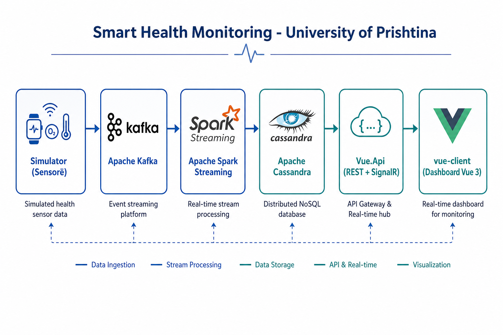
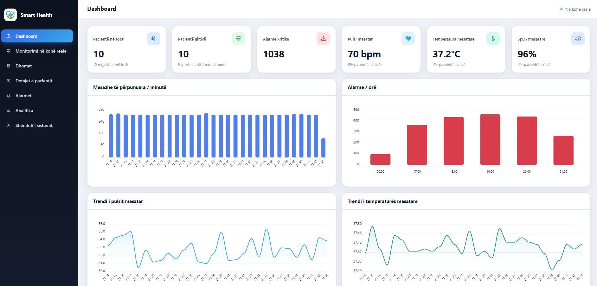
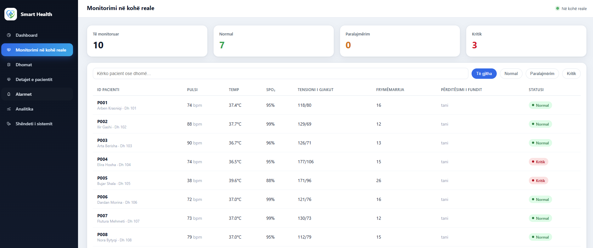
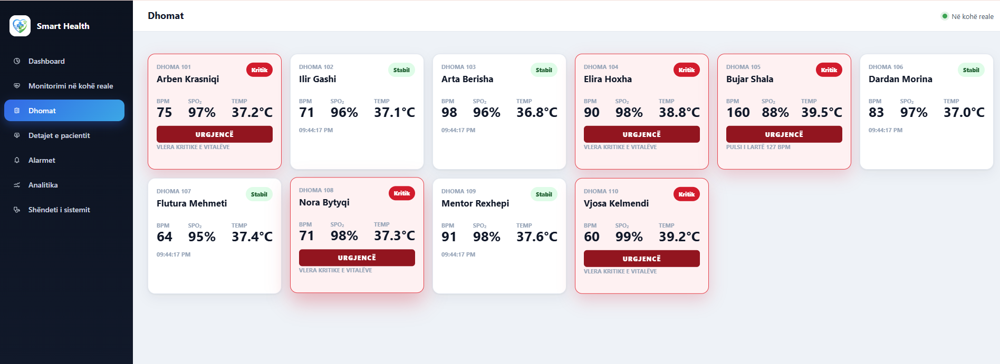
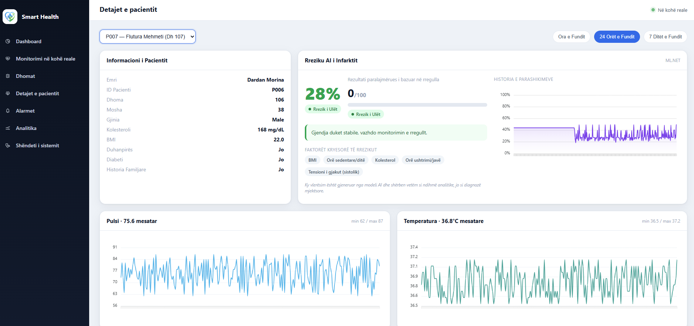
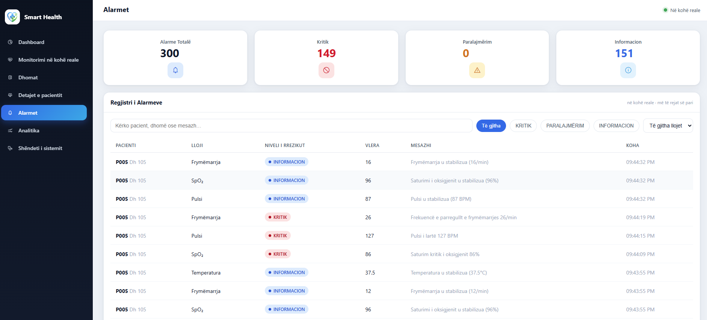
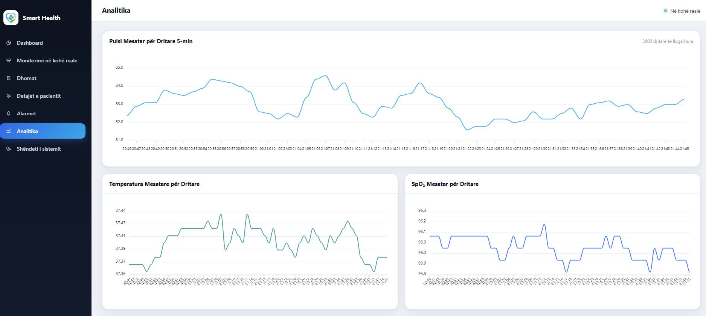
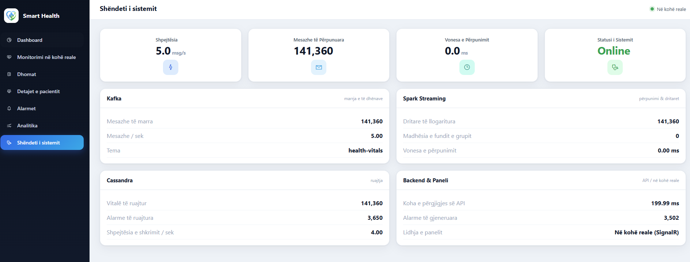

<div align="center">


# Universiteti i Prishtinës

## Fakulteti i Inxhinierisë Elektrike dhe Kompjuterike

**Programi i Studimeve:** Inxhinieri Kompjuterike dhe Softuerike – Master  
**Lënda:** Internet of Things  
**Grupi:** 2

<br>

# Smart Health Monitoring

<br>

## Profesori

Besmir Sejdiu

## Studentët

Rinor Ukshini  
Rina Bunjaku  
Arton Gërguri

</div>

<br>

---

## Përmbledhje

**Smart Health Monitoring** është një sistem IoT i plotë për monitorimin e vitalëve të pacientëve në një mjedis spitalor. Projekti është zhvilluar në kuadër të lëndës *Internet of Things* dhe përmbush kërkesat e **Projektit 2 – Ndërtimi i një sistemi IoT** (Universiteti i Prishtinës, FIEK, 2026).

Sistemi mbledh të dhëna nga sensorë të simuluar, i transmeton përmes **Apache Kafka**, i përpunon në kohë reale me **Apache Spark Structured Streaming**, i ruan në **Apache Cassandra** dhe i vizualizon përmes një ndërfaqeje **Vue 3** të lidhur me backend-in **Vue.Api**.

Përveç kërkesave bazë të projektit, janë implementuar edhe komponentët e avancuar:

- **Inteligjenca Artificiale**: parashikimi i rrezikut të infarktit me ML.NET
- **Sistemi i alarmeve**: motor inteligjent me cooldown dhe persistencë
- **Analiza e performancës**: metrika të pipeline-it në kohë reale

> **Shënim:** Ndërfaqja aktive e projektit është `vue-client` (Vue 3). Versioni i vjetër `Web.Dashboard` (Razor Pages) nuk përdoret në këtë implementim final.

---

## Ideja e projektit

Qëllimi i projektit është të demonstrohet një pipeline IoT i plotë, nga mbledhja e të dhënave deri te vizualizimi live:

1. **10 pacientë** në dhoma **101–110** monitorohen vazhdimisht
2. Sensorët matin: pulsin (BPM), saturimin e oksigjenit (SpO₂), temperaturën, tensionin arterial dhe frekuencën e frymëmarrjes
3. Të dhënat përpunohen në kohë reale për të gjeneruar **alarme**, **agregime** dhe **parashikime AI**
4. Mjeku/stafi shikon gjendjen e pacientëve në një dashboard web me përditësime live

Të dhënat kalojnë nga simulatori te Kafka, përpunohen me Spark, ruhen në Cassandra dhe shfaqen në dashboard-in Vue, të gjitha në kohë reale.

---

## Arkitektura e sistemit

```
┌─────────────┐    ┌─────────────┐    ┌──────────────────┐    ┌─────────────┐
│ Simulator   │───▶│   Kafka     │───▶│ Streaming.App    │───▶│  Cassandra  │
│ (sensorë)   │    │ health-vitals│    │ (Spark Streaming)│    │  (ruajtje)  │
└─────────────┘    └─────────────┘    └────────┬─────────┘    └──────┬──────┘
                                               │ SignalR live         │ REST
                                               ▼                      ▼
                                        ┌─────────────┐        ┌─────────────┐
                                        │   Vue.Api   │◀───────│ vue-client  │
                                        │  REST+Hub   │        │  (Vue 3 UI) │
                                        └─────────────┘        └─────────────┘
```

<p align="center">
  
</p>

### Si arrihet çdo kërkesë e projektit

| Hapi  | Implementimi në projekt | Skedari / komponenti |
|------------|-------------------------|----------------------|
| **1. Zgjedhja e domenit** | Smart Health Monitoring (10 pacientë, dhoma 101–110) | `Simulator.App/Worker.cs` |
| **2. Mbledhja e të dhënave** | Simulator që gjeneron lexime çdo ~2 sekonda | `Simulator.App/` |
| **3. Transmetimi (Kafka)** | Producer → topic `health-vitals` (3 partitions) | `docker-compose.yml`, `Simulator.App` |
| **4. Përpunimi (Spark)** | Filtrim, validim, dritare rrëshqitëse 5 min / slide 1 min | `Streaming.App/Program.cs` |
| **5. Ruajtja (Cassandra)** | Keyspace `smart_health`, 6 tabela | `cassandra-schema.cql` |
| **6. Vizualizimi** | Dashboard Vue 3 me 7 faqe funksionale | `vue-client/`, `Vue.Api/` |
| **7. AI (avancuar)** | ML.NET + RiskScoringEngine | `AI.Training/`, `Vue.Api/Ai/` |
| **8. Alarme (avancuar)** | SmartAlertEngine me cooldown | `Streaming.App/SmartAlertEngine.cs` |
| **9. Performancë (avancuar)** | MetricsCollector + System Health | `Streaming.App/MetricsCollector.cs` |

---

## Çfarë përmban projekti

```
smart-health-monitoring/
│
├── Simulator.App/              # Sensorë të simuluar → Kafka producer
├── Streaming.App/              # Apache Spark Streaming → Cassandra + SignalR
├── Vue.Api/                    # REST API, SignalR Hub, parashikimi ML.NET
├── vue-client/                 # Ndërfaqja web (Vue 3 + Pinia + ApexCharts)
├── AI.Training/                # Trajnimi offline i modelit ML.NET
│
├── cassandra-schema.cql        # Skema e databazës Cassandra
├── docker-compose.yml          # Nisja e gjithë infrastrukturës
└── assets/                     # Logo, diagramë dhe pamje e ndërfaqes
```

### Modulet dhe roli i tyre

| Moduli | Teknologjia | Roli |
|--------|-------------|------|
| `Simulator.App` | .NET 8 Worker | Gjeneron vitalë realiste; profile të ndryshme (kritik / stabil) |
| `Streaming.App` | Spark 3.2 + .NET | Konsumon Kafka, filtron, agregon, alarmon, ruan në Cassandra |
| `Vue.Api` | ASP.NET Core 8 | Lexon nga Cassandra, ekspozon REST API dhe SignalR hub |
| `vue-client` | Vue 3, Vite | Dashboard me monitorim live, dhomat, alarme, AI, analitika |
| `AI.Training` | ML.NET | Trajnon modelin e infarktit nga dataseti klinik |

### Tabelat Cassandra (`smart_health`)

| Tabela | Përmbajtja |
|--------|------------|
| `patient_vitals` | Leximet e papërpunuara të vitalëve |
| `patients` | Regjistri dhe profili klinik i pacientëve |
| `alerts_log` | Historiku i alarmeve (KRITIK / PARALAJMËRIM / INFO) |
| `vitals_window_agg` | Mesataret e dritares 5-minutëshe (Spark) |
| `ai_risk_scores` | Rezultati i rrezikut në kohë reale |
| `ml_predictions` | Parashikimet ML.NET të infarktit |

### Faqet e ndërfaqes (`vue-client`)

| Rruga | Faqja | Funksioni |
|-------|-------|-----------|
| `/` | Dashboard | KPI, trende, alarmet e fundit |
| `/live` | Monitorimi live | Tabela e vitalëve me status Critical/Warning/Normal |
| `/rooms` | Dhomat | Pamje sipas dhomave 101–110 |
| `/patients/:id` | Detajet | Grafikë historik, statistika dhe rreziku AI (ML.NET) për pacientin |
| `/alerts` | Alarmet | Regjistri i alarmeve në kohë reale |
| `/analytics` | Analitika | Agregimet nga dritaret Spark |
| `/system` | Shëndeti i sistemit | Metrikat e Kafka, Spark, Cassandra, API |

---

## Pamje të ndërfaqes

<p align="center">
  
  <br><em>Figura 1: Dashboard </em>
</p>

<p align="center">
  
  <br><em>Figura 2: Monitorimi në kohë reale i vitalëve</em>
</p>

<p align="center">
  
  <br><em>Figura 3: Monitorimi sipas dhomave 101–110</em>
</p>

<p align="center">
  
  <br><em>Figura 4: Detajet e pacientit me rrezikun AI (ML.NET)</em>
</p>

<p align="center">
  
  <br><em>Figura 5: Qendra e alarmeve në kohë reale</em>
</p>

<p align="center">
  
  <br><em>Figura 6: Analitika nga dritaret 5-minutëshe të Spark</em>
</p>

<p align="center">
  
  <br><em>Figura 7: Shëndeti i sistemit (Kafka, Spark, Cassandra, API)</em>
</p>

---

## Instalimi dhe ekzekutimi

### Parakushtet

- [Docker Desktop](https://www.docker.com/products/docker-desktop/) (versioni i fundit, i nisur)
- [Git](https://git-scm.com/)
- (Opsionale, për zhvillim lokal) [.NET 8 SDK](https://dotnet.microsoft.com/download/dotnet/8.0), [Node.js 18+](https://nodejs.org/)

### 1. Klono projektin

```powershell
git clone <url-e-repo-së>
cd smart-health-monitoring
```

### 2. Nis sistemin e plotë me Docker (rekomanduar për mbrojtje)

```powershell
docker compose up -d --build
```

Kjo nis automatikisht:

| Rendi | Shërbimi | Roli |
|-------|----------|------|
| 1 | `zookeeper`, `kafka`, `kafka-init` | Broker mesazhesh + topic `health-vitals` |
| 2 | `cassandra`, `cassandra-init` | Baza e të dhënave + skema |
| 3 | `vue-api` | API REST dhe SignalR hub |
| 4 | `vue-client` | Ndërfaqja Vue (nginx) |
| 5 | `streaming` | Apache Spark Structured Streaming |
| 6 | `simulator` | Gjenerimi i të dhënave të sensorëve |

### 3. Hap dashboard-in

| Shërbimi | URL |
|----------|-----|
| **Ndërfaqja (Vue)** | **http://localhost:5173** |
| API (REST / SignalR) | http://localhost:5099 |
| Kafka | `localhost:9092` |
| Cassandra | `localhost:9042` |

### 4. Verifiko që sistemi punon

```powershell
# Statusi i containerëve
docker compose ps

# Logjet e simulatorit (të dhënat po dërgohen?)
docker compose logs -f simulator

# Logjet e Spark streaming
docker compose logs -f streaming

# Logjet e API-së
docker compose logs -f vue-api
```

### 5. Ndal sistemin

```powershell
docker compose down
```

Për të fshirë edhe volumet (të dhënat e Cassandra):

```powershell
docker compose down -v
```

---

## Si të ekzekutohet kodi (pa Docker)

Për zhvillim lokal, komponentët mund të nisen veç e veç. Renditja e rëndësishme:

### Hapi 1: Infrastruktura

```powershell
docker compose up -d zookeeper kafka kafka-init cassandra cassandra-init
```

### Hapi 2: Vue.Api

```powershell
dotnet run --project Vue.Api
```

> Konfiguro `Cassandra__ContactPoint=localhost` dhe `DataGeneration__Enabled=false` në `appsettings.Development.json`.

### Hapi 3: vue-client

```powershell
cd vue-client
npm install
npm run dev
```

Hap: **http://localhost:5173**

### Hapi 4: Streaming.App

```powershell
# Mënyra Spark (kërkon Java + spark-submit)
dotnet run --project Streaming.App -- --spark

# Ose mënyra direkte (fallback pa JVM)
$env:STREAMING_MODE="direct"
dotnet run --project Streaming.App
```

### Hapi 5: Simulator.App

```powershell
dotnet run --project Simulator.App
```

### Hapi 6 (opsionale): Trajnimi i modelit AI

```powershell
dotnet run --project AI.Training
```

Modeli ruhet në `Vue.Api/AiModels/heart_attack_model.zip`.

---

## Rrjedha e të dhënave (hap pas hapi)

```
1. Simulator.App/Worker.cs
   └─ CreateReading() → JSON me vitalë + profil klinik

2. Apache Kafka (topic: health-vitals)
   └─ Mesazh me key = patientId

3. Streaming.App/Program.cs
   ├─ Spark ReadStream nga Kafka
   ├─ Filter: validim i leximeve
   ├─ ProcessReadingAsync():
   │    ├─ INSERT → patient_vitals, patients
   │    ├─ SignalR → vitalsReceived, alertReceived
   │    ├─ RiskScoringEngine → ai_risk_scores
   │    └─ SmartAlertEngine → alerts_log
   └─ Dritare 5 min / slide 1 min → vitals_window_agg

4. Apache Cassandra (smart_health)
   └─ Ruajtje historike dhe agregime

5. Vue.Api
   ├─ REST /api/* → lexon nga Cassandra
   └─ SignalR /healthHub → transmeton te UI

6. vue-client
   └─ Përditësim live (SignalR) + polling (REST)
```

---

## Komponentët e avancuar

### Inteligjenca Artificiale

| Pjesa | Përshkrimi |
|-------|------------|
| `AI.Training/Program.cs` | Trajnon modelin ML.NET (FastTree) nga dataseti i infarktit |
| `HeartAttackPredictionService.cs` | Parashikon probabilitetin e rrezikut (0–1) |
| `MlPredictionWorker.cs` | Ekzekuton parashikime periodike dhe gjeneron alarme `AI_HEART_RISK` |
| `RiskScoringEngine.cs` | Vlerëson rrezikun në kohë reale gjatë streaming (si NEWS score) |

### Sistemi i alarmeve

`SmartAlertEngine` nuk alarmon për çdo lexim, por përdor:

- **Cooldown** 5 minuta për të njëjtin lloj alarmi
- **Persistencë**: vlera duhet të qëndrojë jashtë normës për disa sekonda/minuta
- **Stabilizim**: mesazh INFO kur pacienti kthehet në normale

### Analiza e performancës

`MetricsCollector` mat mesazhe/sekondë, latencën e batch-it dhe numrin e alarmeve. Metrikat shfaqen në faqen **Shëndeti i sistemit** (`/system`).


## Teknologjitë e përdorura

| Shtresa | Teknologjia |
|---------|-------------|
| Simulator | .NET 8 Worker Service |
| Message Broker | Confluent Platform 7.7 (Apache Kafka 3.7) |
| Stream Processing | Apache Spark 3.2 (Microsoft.Spark) |
| Database | Apache Cassandra 4.1 |
| Backend API | ASP.NET Core 8, SignalR |
| Frontend | Vue 3, Pinia, Vue Router, ApexCharts |
| AI / ML | ML.NET (FastTree), Risk Scoring |
| Kontejnerizimi | Docker, Docker Compose |

---

## Sfidat dhe mësimet e nxjerra

Gjatë ndërtimit të sistemit u hasën disa sfida teknike, trajtimi i të cilave përbën edhe mësimet kryesore të projektit.

| Sfida | Si u trajtua |
|-------|--------------|
| Garancia e moshumbjes së të dhënave nga Kafka | Përdorimi i checkpoint-eve për ruajtjen e offset-eve dhe rifillimin pa humbje pas restartit |
| Të dhëna jashtë rendit në agregime | Përdorimi i watermark-ut me dritare rrëshqitëse 5-minutëshe për tolerimin e vonesave |
| Tepricë alarmesh (alert fatigue) | Logjika me cooldown dhe persistencë në `SmartAlertEngine`, jo një alarm për çdo lexim |
| Komunikimi në kohë reale me ndërfaqen | Lidhja e `Streaming.App` si klient SignalR te hub-i i `Vue.Api` |

Mësimet kryesore: decoupling-u me Kafka e bën sistemin më të qëndrueshëm dhe të zgjerueshëm. Përpunimi në kohë reale kërkon balancim midis saktësisë dhe vonesës.

---

## Përfundime dhe Rekomandime

Projekti realizon një pipeline IoT funksional nga fillimi në fund, duke përmbushur të gjitha kërkesat teknike: mbledhja e të dhënave nga sensorë të simuluar, transmetimi përmes Apache Kafka, përpunimi në kohë reale me Apache Spark Structured Streaming, ruajtja në Apache Cassandra dhe vizualizimi në një ndërfaqe Vue 3. Përveç kërkesave bazë, janë integruar edhe tri komponentët e avancuar: inteligjenca artificiale, sistemi i alarmeve dhe analiza e performancës.

Bazuar në përvojën e zhvillimit, rekomandohet:

- Përdorimi i Apache Kafka si shtresë qendrore e transmetimit në çdo sistem IoT me volum të lartë të dhënash, për shkak të decoupling-ut dhe buffering-ut.
- Projektimi i skemës së Cassandra-s sipas modelit të pyetjeve, për të arritur performancë optimale të leximit.

---

## Puna e ardhshme

Sistemi mund të zgjerohet më tej me drejtimet e mëposhtme:

- Zëvendësimi i simulatorit me sensorë fizikë realë, p.sh. përmes protokollit MQTT.
- Shtimi i autentikimit dhe autorizimit me role për stafin mjekësor.
- Ritrajnimi i modelit të AI me një dataset klinik më të pasur.
- Politika ruajtjeje afatgjatë me TTL dhe arkivim të të dhënave historike.

---

## Dokumentacion shtesë

| Dokumenti | Përmbajtja |
|-----------|------------|
| [README-DOCKER.md](README-DOCKER.md) | Detaje Docker, Spark vs Direct mode |
| [README-STRUKTURA-PROJEKTIT.md](README-STRUKTURA-PROJEKTIT.md) | Strukturë e detajuar |
| [README-CAPACITOR.md](README-CAPACITOR.md) | Aplikacioni mobil (opsional) |


<div align="center">

*Smart Health Monitoring · Projekti IoT, Grupi 2*

</div>
